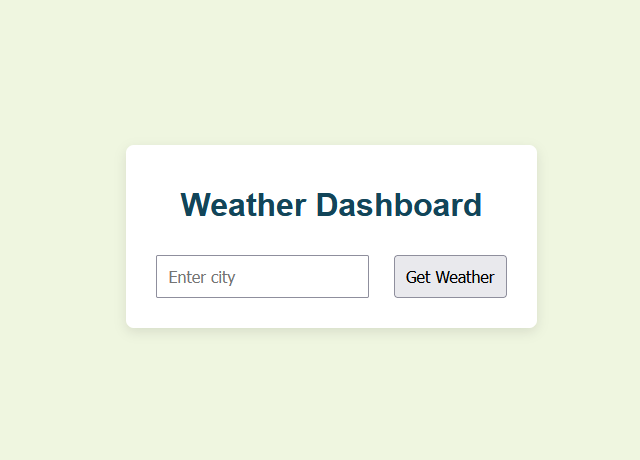

# Weather Dashboard 🌤️

A simple and responsive weather app built with HTML, CSS, and JavaScript.

## Features
- Get real-time weather by city name
- Uses OpenWeatherMap API
- Responsive and beginner-friendly

## Screenshot

## How to Use
1. Enter a city name
2. Click "Get Weather"
3. View current weather info

## Live Demo
[Live on GitHub Pages](https://Umutcanndurbak.github.io/weather-dashboard/)

---

© 2025 Umutcan Durbak
